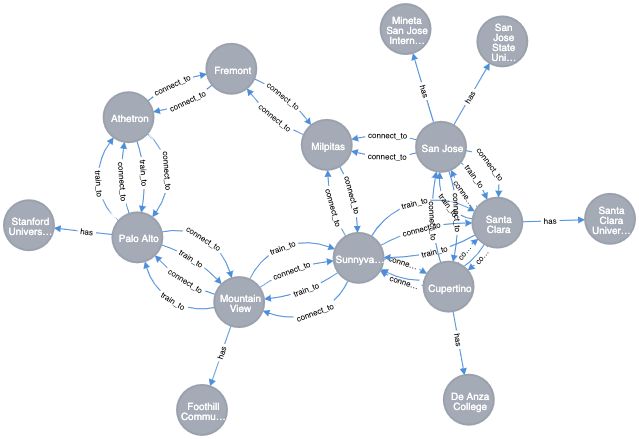

  
  
#  Database | Assignment 4
  
**Graph Algorithms for Search in Graph Database**
  
By **Daniel, Jacob, Nikolaj & Stephan**  
Institute **CPHBusiness**  
  
Education **Software Development**  
Elective **Databases**  
Topic **Graph Databases** 
  
The objective of this assignment is to provide practice in applying graph algorithms for searching in graph databases.
  
Graph algorithms can be used for discovering patterns and meaningful information, hidden in the nodes, relations, and properties of graph database components.
  
Your task is to import or create a sample Neo4j database, appropriate for testing graph algorithms and research this database to
* identify the **most important** nodes, based on their relationships
* detect the close **connected communities** of nodes
* discover **similarity between nodes**, based on their properties or behavior
* find **available routes or optimal paths** between the nodes
  
Suggest implementation of the results in the business, related with your data.
  
___
  
##  Content
  
  
- [Database Setup](#database-setup )
- [Solutions](#solutions )
  - [Most Important Nodes | Page Rank](#most-important-nodes-page-rank )
  - [Close Connected Communities | Louvain](#close-connected-communities-louvain )
  - [Similarity Between Nodes | Node Similarity](#similarity-between-nodes-node-similarity )
  - [Available Routes / Optimal Paths | Shortest Path](#available-routes-optimal-paths-shortest-path )
    - [Palo Alto to Santa Clara](#palo-alto-to-santa-clara )
    - [Athetron to Cupertino](#athetron-to-cupertino )
    - [Mountain View to Fremont](#mountain-view-to-fremont )
  
___
##  Database Setup
  
  
**Name** GraphAlgorithms
**Password** pass
**Version** 3.5.17
  
**Plugin** APOC
**Plugin** Graph Data Science Library
_install plugins @ ⋮ (Manage) → Plugins_
  
**Data-set** [San Francisco Bay Map](https://neo4j.com/graphgist/learning-cypher-with-san-francisco-bay-map/ )
  

  
**Create Graph Function**
  
_Graph Function Name_
the first argument represents the reference name of the graph function, in this case `graph`.
  
_Node_
the second argument represents the target node, in this case `City`.
  
_Relation_
the third argument represents the relation that between the targets nodes, in this case `connect_to`.
  
_Relationship Properties_
the last argument represents the targets property from the relation, in this case `distance`.
  
_cypher_
```sql
CALL gds.graph.create('graph', 'City', 'connect_to', { relationshipProperties: 'distance'})
```
  
___
##  Solutions
  
  
###  Most Important Nodes | Page Rank
  
_cypher_
```sql
CALL gds.pageRank.stream('graph', { maxIterations: 20, dampingFactor: 0.85 })
YIELD nodeId, score
RETURN gds.util.asNode(nodeId).name AS name, score
ORDER BY score DESC, name ASC
```
  
_response_
  
|name|score|  
|---|---|  
|Sunnyvale|1.4627125821076332|  
|Milpitas|1.1650443203281606|  
|Fremont|1.0598599660210313|  
|Athetron|0.989260438363999|  
|Palo Alto|0.9270565305138007|  
|Mountain View|0.8505048173945399|  
|Cupertino|0.8188349188305439|  
|Santa Clara|0.8188349180389197|  
|San Jose|0.6113811442395671|  
  
  
  
###  Close Connected Communities | Louvain
  
_cypher_
```sql
CALL gds.louvain.stream('graph')
YIELD nodeId, communityId, intermediateCommunityIds
RETURN gds.util.asNode(nodeId).name AS name, communityId, intermediateCommunityIds
ORDER BY name ASC
```
  
_response_
  
|name|communityId|intermediateCommunityIds|  
|---|---|---|  
|Athetron|1|null|  
|Cupertino|7|null|  
|Fremont|4|null|  
|Milpitas|4|null|  
|Mountain View|1|null|  
|Palo Alto|1|null|  
|San Jose|4|null|  
|Santa Clara|7|null|  
|Sunnyvale|7|null|  
  
  
###  Similarity Between Nodes | Node Similarity
  
_cypher_
```sql
CALL gds.nodeSimilarity.stream('graph')
YIELD node1, node2, similarity
RETURN gds.util.asNode(node1).name AS city1, gds.util.asNode(node2).name AS city2, similarity
ORDER BY similarity DESCENDING, city1, city2
```
  
_response_
  
|city1|city2|similarity|  
|---|---|---|  
|San Jose|Sunnyvale|0.75|  
|Sunnyvale|San Jose|0.75|  
|Cupertino|Santa Clara|0.5|  
|Santa Clara|Cupertino|0.5|  
|Athetron|Milpitas|0.3333333333333333|  
|Athetron|Mountain View|0.3333333333333333|  
|Fremont|Palo Alto|0.3333333333333333|  
|Milpitas|Athetron|0.3333333333333333|  
|Milpitas|Mountain View|0.3333333333333333|  
|Mountain View|Athetron|0.3333333333333333|  
|Mountain View|Milpitas|0.3333333333333333|  
|Palo Alto|Fremont|0.3333333333333333|  
|Cupertino|Milpitas|0.25|  
|Cupertino|Mountain View|0.25|  
|Fremont|San Jose|0.25|  
|Milpitas|Cupertino|0.25|  
|Milpitas|Santa Clara|0.25|  
|Mountain View|Cupertino|0.25|  
|Mountain View|Santa Clara|0.25|  
|San Jose|Fremont|0.25|  
|Santa Clara|Milpitas|0.25|  
|Santa Clara|Mountain View|0.25|  
|Cupertino|San Jose|0.2|  
|Fremont|Sunnyvale|0.2|  
|Palo Alto|Sunnyvale|0.2|  
|San Jose|Cupertino|0.2|  
|San Jose|Santa Clara|0.2|  
|Santa Clara|San Jose|0.2|  
|Sunnyvale|Fremont|0.2|  
|Sunnyvale|Palo Alto|0.2|  
|Cupertino|Sunnyvale|0.16666666666666666|  
|Santa Clara|Sunnyvale|0.16666666666666666|  
|Sunnyvale|Cupertino|0.16666666666666666|  
|Sunnyvale|Santa Clara|0.16666666666666666|  
  
  
###  Available Routes / Optimal Paths | Shortest Path
  
  
####  Palo Alto to Santa Clara
  
  
_cypher_
```sql
MATCH(start:City { name: 'Palo Alto' }), (end:City { name: 'Santa Clara' })
  
CALL gds.alpha.shortestPath.stream({
nodeProjection: 'City',
relationshipProjection: {
connect_to: { type: 'connect_to', properties: 'distance', orientation: 'UNDIRECTED' } },
startNode: start, endNode: end, writeProperty: 'distance'})
YIELD nodeId, cost
RETURN gds.util.asNode(nodeId).name AS name, cost
```
  
_response_
  
|name|cost|  
|---|---|  
|Palo Alto|0.0|  
|Mountain View|1.0|  
|Sunnyvale|2.0|  
|Santa Clara|3.0|  
  
  
  
####  Athetron to Cupertino
  
  
_cypher_
```sql
MATCH(start:City { name: 'Athetron' }), (end:City { name: 'Cupertino' })
  
CALL gds.alpha.shortestPath.stream({
nodeProjection: 'City',
relationshipProjection: {
connect_to: { type: 'connect_to', properties: 'distance', orientation: 'UNDIRECTED' } },
startNode: start, endNode: end, writeProperty: 'distance'})
YIELD nodeId, cost
RETURN gds.util.asNode(nodeId).name AS name, cost
```
  
_response_
  
|name|cost|  
|---|---|  
|Athetron|0.0|  
|Palo Alto|1.0|  
|Mountain View|2.0|  
|Sunnyvale|3.0|  
|Cupertino|4.0|  
  
  
####  Mountain View to Fremont
  
  
_cypher_
```sql
MATCH(start:City { name: 'Mountain View' }), (end:City { name: 'Fremont' })
  
CALL gds.alpha.shortestPath.stream({
nodeProjection: 'City',
relationshipProjection: {
connect_to: { type: 'connect_to', properties: 'distance', orientation: 'UNDIRECTED' } },
startNode: start, endNode: end, writeProperty: 'distance'})
YIELD nodeId, cost
RETURN gds.util.asNode(nodeId).name AS name, cost
```
  
_response_
  
|name|cost|  
|---|---|  
|Mountain View|0.0|  
|Palo Alto|1.0|  
|Athetron|2.0|  
|Fremont|3.0|  
  
  