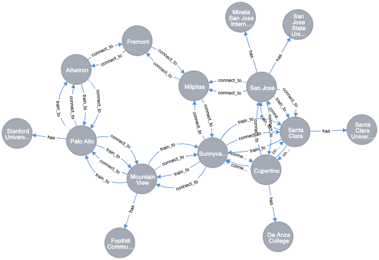

---
export_on_save:
  markdown: true
markdown:
  path: README.md
  ignore_from_front_matter: true
---

# Database | Assignment A4 {ignore=true}
**Graph Algorithms for Search in Graph Database**

By **Daniel, Jacob, Nikolaj & Stephan**  
Institute **CPHBusiness**  

Education **Software Development**  
Elective **Databases**  
Topic **Graph Databases** 

The objective of this assignment is to provide practice in applying graph algorithms for searching in graph databases.

Graph algorithms can be used for discovering patterns and meaningful information, hidden in the nodes, relations, and properties of graph database components.

Your task is to import or create a sample Neo4j database, appropriate for testing graph algorithms and research this database to
* identify the **most important** nodes, based on their relationships
* detect the close **connected communities** of nodes
* discover **similarity between nodes**, based on their properties or behavior
* find **available routes or optimal paths** between the nodes

Suggest implementation of the results in the business, related with your data.

___

## Content {ignore=true}
[TOC]

___
## Database Setup

**Name** GraphAlgorithms
**Password** pass
**Version** 3.5.17

**Plugin** APOC
**Plugin** Graph Data Science Library
_install plugins @ ⋮ (Manage) → Plugins_

**Data-set** [San Francisco Bay Map](https://neo4j.com/graphgist/learning-cypher-with-san-francisco-bay-map/)



**Create Graph Function**

_Graph Function Name_
the first argument represents the reference name of the graph function, in this case `graph`.
  
_Node_
the second argument represents the target node, in this case `City`.
  
_Relation_
the third argument represents the relation that between the targets nodes, in this case `connect_to`.

_Relationship Properties_
the last argument represents the targets property from the relation, in this case `distance`.

_cypher_
```sql
CALL gds.graph.create('graph', 'City', 'connect_to', { relationshipProperties: 'distance'})
```

___
## Solutions

### Most Important Nodes | Page Rank
_cypher_
```sql
CALL gds.pageRank.stream('graph', { maxIterations: 20, dampingFactor: 0.85 })
YIELD nodeId, score
RETURN gds.util.asNode(nodeId).name AS name, score
ORDER BY score DESC, name ASC
```

_response_
@import "assets/page-rank-response.csv"


### Close Connected Communities | Louvain
_cypher_
```sql
CALL gds.louvain.stream('graph')
YIELD nodeId, communityId, intermediateCommunityIds
RETURN gds.util.asNode(nodeId).name AS name, communityId, intermediateCommunityIds
ORDER BY name ASC
```

_response_
@import "assets/louvain-response.csv"

### Similarity Between Nodes | Node Similarity
_cypher_
```sql
CALL gds.nodeSimilarity.stream('graph')
YIELD node1, node2, similarity
RETURN gds.util.asNode(node1).name AS city1, gds.util.asNode(node2).name AS city2, similarity
ORDER BY similarity DESCENDING, city1, city2
```

_response_
@import "assets/node-similarity-response.csv"

### Available Routes / Optimal Paths | Shortest Path

#### Palo Alto to Santa Clara

_cypher_
```sql
MATCH(start:City { name: 'Palo Alto' }), (end:City { name: 'Santa Clara' })

CALL gds.alpha.shortestPath.stream({
nodeProjection: 'City',
relationshipProjection: {
connect_to: { type: 'connect_to', properties: 'distance', orientation: 'UNDIRECTED' } },
startNode: start, endNode: end, writeProperty: 'distance'})
YIELD nodeId, cost
RETURN gds.util.asNode(nodeId).name AS name, cost
```

_response_
@import "assets/shortest-path-response-1.csv"


#### Athetron to Cupertino

_cypher_
```sql
MATCH(start:City { name: 'Athetron' }), (end:City { name: 'Cupertino' })

CALL gds.alpha.shortestPath.stream({
nodeProjection: 'City',
relationshipProjection: {
connect_to: { type: 'connect_to', properties: 'distance', orientation: 'UNDIRECTED' } },
startNode: start, endNode: end, writeProperty: 'distance'})
YIELD nodeId, cost
RETURN gds.util.asNode(nodeId).name AS name, cost
```

_response_
@import "assets/shortest-path-response-2.csv"

#### Mountain View to Fremont

_cypher_
```sql
MATCH(start:City { name: 'Mountain View' }), (end:City { name: 'Fremont' })

CALL gds.alpha.shortestPath.stream({
nodeProjection: 'City',
relationshipProjection: {
connect_to: { type: 'connect_to', properties: 'distance', orientation: 'UNDIRECTED' } },
startNode: start, endNode: end, writeProperty: 'distance'})
YIELD nodeId, cost
RETURN gds.util.asNode(nodeId).name AS name, cost
```

_response_
@import "assets/shortest-path-response-3.csv"